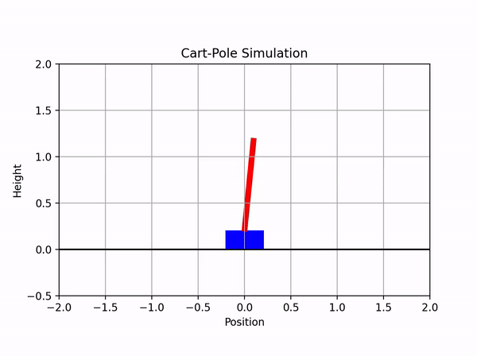
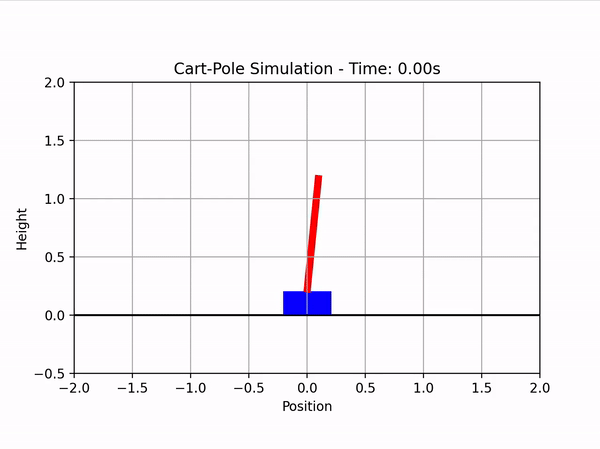

# underactuated-systems
Code for simulating
- a double pendulum 
- a cartpole
in matlab and visualizing the result.

## Double pendulum

Load the workspace in doublependulum.mat and run the script doublependulum.m, which creates a csv file with the simuulation result. Run the script simviz.py to visualize the data.

## Cartpole
Uncontrolled dynamics

With LQR controller:

Edit the script cartpole.m to choose which system (uncontrolled, controlled with handpicked gains, or controlled with LQR gains) to simulate.

## Reference
The pendulum dynamics are based off the derivation in the lecture notes:

Russ Tedrake. Underactuated Robotics: Algorithms for Walking, Running, Swimming, Flying, and Manipulation (Course Notes for MIT 6.832). Downloaded on 22 Sept. 2024 from https://underactuated.csail.mit.edu/.
